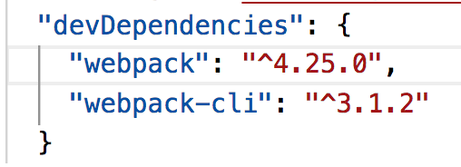

# webpack-react-project
webpack练习
1. 首先创建一个项目文件夹,并进入到该文件夹：

    mkdir react-webpack-project
2. 初始化项目：npm init 根据提示创建package.json
3. 通过NPM安装webpack和webpack-cli,其中-D相当于--save-dev: npm install webpack webpack-cli -D，安装完成后可在package.json中查看具体的安装版本信息：

4. webpack4 以上的版本，会默认配置,比如默认的入口文件，默认的输出文件，因此暂时无需额外的配置
5. 在根目录下新建src文件夹，并在其中创建index.js文件，在文件中写入console.log('hello react');
6.直接通过npm run dev
6. package.json 中scripts中配置

        "scripts": {
            "dev": "webpack --mode development",
            "build": "webpack --mode production"
        } 

7. npm run dev,成功打包后，发现项目里多了一个dist文件夹，可通过npm run dev/npm run build分别打包对比生成的main.js的文件大小，npm run build,你会发现main.js文件小了很多
8. 配置babel编译es6的代码，在根目录下新建.babelrc文件，并写入以下代码：

        {
            "presets": [
                "env"
            ]
        }
9.通过npm安装babel
    npm install babel-core babel-loader babel-preset-env --save-dev
10. 为方便管理，将webpack.config.js单独创建，与package.json分开，在根目录下创建webpack.config.js文件，写入如下代码：

    // webpack v4
    const path = require('path');
    module.exports = {
    entry: { main: './src/index.js' },
    output: {
        path: path.resolve(__dirname, 'dist'),
        filename: 'main.js'
    },
    module: {
        rules: [
        {
            test: /\.js$/,
            exclude: /node_modules/,
            use: {
            loader: "babel-loader"
            }
        }
        ]
    }
    };
11. 通过npm run dev发现babel版本过低报错，因此将babel版本升级，安装完成后npm run dev能进行正常打包

    npm i babel-loader@7.1.5 -D
12. 在dist文件夹下新建index.html文件，并写入以下内容，其中引用了css文件

    <html>
    <head>
        <link rel="stylesheet" href="style.css">
    </head>
    <body>
        
Hello, world!

        
    </body>
    </html>
13. 在src文件下新建style.css,写入任意css表达式，并将其引用至index.js中,再次通过npm run dev出现报错，提示“You may need an appropriate loader to handle this file type”，需要安装配置css-loader

    div{background-color:red};

    import "./style.css";
    console.log("hello, world");
14. 通过npm下载[css-loader](https://www.webpackjs.com/loaders/css-loader/)和[style-loader](https://www.webpackjs.com/loaders/style-loader/):

    npm install css-loader style-loader -D
    另外还需安装[extract-text-webpack-plugin](https://github.com/webpack-contrib/extract-text-webpack-plugin/blob/webpack-1/README.md)插件(通过@next安装新版本，低版本在[webpack4](https://github.com/webpack-contrib/extract-text-webpack-plugin/issues/701)上无法正常运行):

        npm install --save-dev extract-text-webpack-plugin@next
    
    
    安装完成后对webpack.config.js进行配置,在rules中添加css-loader配置，引入extract-text-webpack-plugin并配置plugins，配置完成后通过npm run dev可正常进行编译

        const ExtractTextPlugin = require('extract-text-webpack-plugin');

        {
        test: /\.css$/,
        use: ExtractTextPlugin.extract(
          {
            fallback: 'style-loader',
            use: ['css-loader']
          })
        }

        plugins:[
        new ExtractTextPlugin("styles.css")
        ]
    15. 在src下新建index.html文件：

            <html>
                <head>
                <link rel="stylesheet" href="style.css">
                </head>
                <body>
                
Hello, world!

                
                </body>
            </html>
    16. 安装html-webpack-plugin插件，并进行相应的配置：

        npm install extract-text-webpack-plugin -D
        webpack.config.js中的配置信息如下：

            const HtmlWebpackPlugin = require('html-webpack-plugin');
            plugins:[ 
                new ExtractTextPlugin("styles.css"),
                new HtmlWebpackPlugin({
                    inject: false,
                    hash: true,
                    template: './src/index.html',
                    filename: 'index.html'
                })
            ]
    17. 基本配置已完成，可将dist文件夹下的内容删除后，运行npm run dev进行编译。

       
